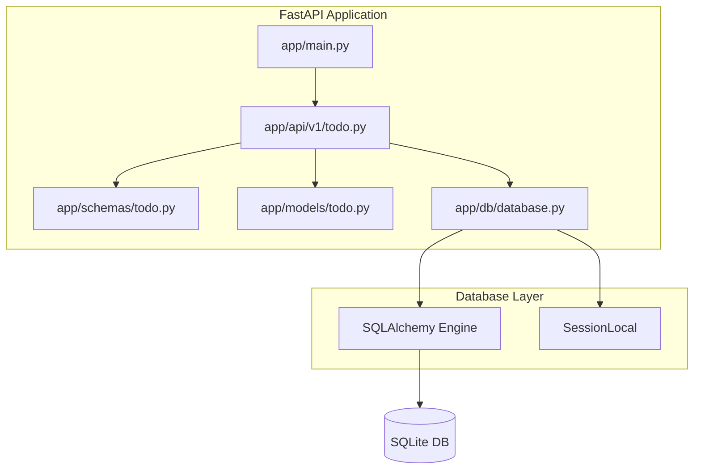

# Architecture Overview



## Directory Layout

```
/todo-api
│   README.md
│   requirements.txt
│   pyproject.toml   # optional, for build system
│
└───app
    │   __init__.py
    │   main.py               # FastAPI entry point
    │
    ├───api
    │   └───v1
    │       │   __init__.py
    │       │   todo.py      # CRUD router for todo items
    │
    ├───db
    │   │   __init__.py
    │   │   database.py      # Engine & SessionLocal creation
    │
    ├───models
    │   │   __init__.py
    │   │   todo.py          # SQLAlchemy ORM model
    │
    └───schemas
        │   __init__.py
        │   todo.py          # Pydantic schemas for request/response
```

## Technology Choices
- **FastAPI** – modern, async‑ready web framework with automatic OpenAPI docs.
- **Uvicorn** – ASGI server for development and production.
- **SQLAlchemy** – ORM to interact with SQLite; using the 2.0 style `declarative_base`.
- **Pydantic** – data validation and serialization for request/response bodies.
- **SQLite** – lightweight file‑based database, perfect for a simple todo app.

## Key Design Decisions
1. **Modular Structure** – Separate concerns into `api`, `models`, `schemas`, and `db` packages.
2. **Dependency Injection** – FastAPI `Depends` will provide a DB session per request.
3. **CRUD Router** – All todo endpoints live under `/api/v1/todos`.
4. **Pydantic Schemas** – Distinguish between `TodoCreate`, `TodoUpdate`, and `TodoRead`.
5. **Database Session Management** – `SessionLocal` is scoped to each request and closed automatically.

## Next Steps
- Implement the scaffold files (`app/main.py`, `app/db/database.py`, `app/models/todo.py`, `app/schemas/todo.py`, `app/api/v1/todo.py`).
- Backend developer will fill in the CRUD logic and SQLite integration.
