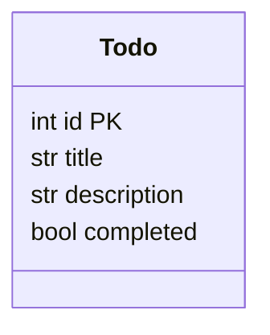

# Architecture Overview

## High‑level Diagram

```mermaid
flowchart LR
    subgraph DockerCompose
        B[Backend (FastAPI)] -->|SQLite DB File| DB[(SQLite DB)]
        F[Frontend (Static HTML/JS)] -->|HTTP API| B
    end
    CI[GitHub Actions CI] --> B
    CI --> F
```

## Components

| Component | Technology | Responsibility |
|-----------|------------|----------------|
| **Backend API** | FastAPI (Python 3.11) + SQLite (via SQLAlchemy) | Exposes CRUD endpoints for Todo items (`/todos`). Handles data validation, business logic, and persistence. |
| **Frontend** | Plain HTML/CSS/JavaScript (served by Nginx) | Simple UI to interact with the API – list, create, edit, delete todos. |
| **Database** | SQLite file (`app.db`) stored in a Docker volume | Stores Todo records. |
| **Docker** | Docker & Docker‑Compose | Provides isolated runtime for backend, frontend, and shared DB volume. |
| **CI/CD** | GitHub Actions | Runs unit tests, linting, and builds Docker images on each push. |

## Data Model



## API Endpoints (FastAPI)

| Method | Path | Description |
|--------|------|-------------|
| `POST` | `/todos/` | Create a new todo |
| `GET` | `/todos/` | List all todos |
| `GET` | `/todos/{id}` | Retrieve a single todo |
| `PUT` | `/todos/{id}` | Update a todo |
| `DELETE` | `/todos/{id}` | Delete a todo |

## Development Workflow
1. **Design** – Architecture defined in this document.
2. **Implementation** – Backend and frontend developers fill in the TODO sections.
3. **Testing** – QA writes tests covering >90% of the code.
4. **CI** – GitHub Actions runs the test suite on every push.
5. **Deployment** – Docker‑Compose can be used locally; CI can push images to a registry.

---

*All scaffold files contain `TODO` comments where implementation is required.*
