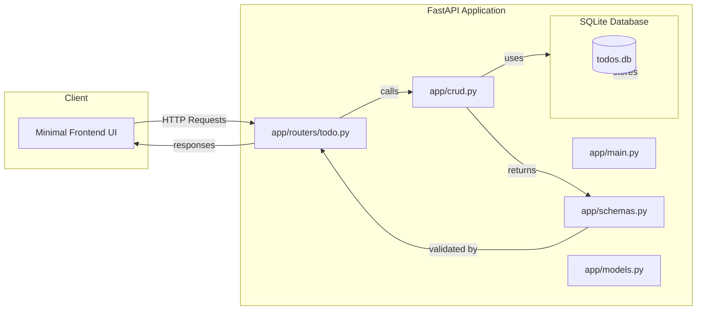

# System Architecture

This document outlines the high‑level design of the **FastAPI Todo API** project, covering the overall architecture, technology stack, module responsibilities, data model, and interaction flow.

---

## 1. Overview

The system is a **RESTful** service built with **FastAPI** that provides CRUD operations for Todo items stored in a **SQLite** database via **SQLAlchemy** ORM. The API is intended to be lightweight, easy to deploy, and extensible for future features (e.g., authentication, user management).

A minimal **frontend** (to be implemented) will consume the API using standard HTTP requests.

---

## 2. Technology Stack

| Layer | Technology | Reasoning |
|-------|------------|-----------|
| **Web Framework** | FastAPI | High performance, automatic OpenAPI docs, async support |
| **Database** | SQLite (via SQLAlchemy) | Simple file‑based DB, no external service needed for a small app |
| **ORM** | SQLAlchemy (declarative) | Mature, flexible, works well with FastAPI |
| **Data Validation** | Pydantic | FastAPI integrates tightly for request/response models |
| **Testing** | pytest, pytest‑asyncio, coverage | Popular, easy to write async tests |
| **CI/CD** | GitHub Actions | Native to GitHub, simple YAML pipelines |
| **Frontend** | (to be decided – e.g., plain HTML/JS or React) | Minimal UI for demonstration |

---

## 3. High‑Level Architecture Diagram



---

## 4. Module Responsibilities

| Module | Responsibility |
|--------|----------------|
| `app/main.py` | FastAPI app creation, include routers, configure middleware |
| `app/routers/todo.py` | Define API endpoints (`/todos`, `/todos/{id}`) and request handling |
| `app/crud.py` | Core CRUD operations interacting with the DB session |
| `app/models.py` | SQLAlchemy ORM models (e.g., `Todo`) |
| `app/schemas.py` | Pydantic models for request bodies and responses |
| `app/database.py` | Engine creation, session management, Base metadata |
| `tests/` | Pytest fixtures, test cases covering all endpoints |
| `docs/architecture.md` | This architecture document |
| `README.md` | Project overview and usage instructions |

---

## 5. Data Model

```python
class Todo(Base):
    __tablename__ = "todos"
    id = Column(Integer, primary_key=True, index=True)
    title = Column(String, nullable=False)
    description = Column(String, nullable=True)
    completed = Column(Boolean, default=False)
```

Corresponding Pydantic schemas:
- `TodoCreate` – fields required for creation (title, description optional)
- `TodoUpdate` – all fields optional for partial updates
- `TodoRead` – fields returned to the client (including `id`)

---

## 6. Interaction Flow

1. **Client** sends an HTTP request to the FastAPI endpoint.
2. **Router** validates the request body using Pydantic schemas.
3. **Router** calls the appropriate function in **CRUD**.
4. **CRUD** obtains a DB session from **database.py**, performs the operation, and commits.
5. **CRUD** returns a SQLAlchemy model instance, which the router converts to a Pydantic response schema.
6. **FastAPI** serializes the response to JSON and sends it back to the client.

---

## 7. Testing Strategy

- Use **pytest** with **async** support (`pytest-asyncio`).
- Fixtures provide a temporary SQLite database for isolation.
- Tests cover:
  - Successful creation, retrieval, update, deletion
  - Validation errors (missing fields, invalid types)
  - Edge cases (non‑existent IDs)
- Coverage target: **≥90%** of the `app/` package.

---

## 8. CI Pipeline (GitHub Actions)

- Run on `push` and `pull_request` events.
- Steps:
  1. Checkout code.
  2. Set up Python (3.11).
  3. Install dependencies (`pip install -r requirements.txt`).
  4. Run linting (`ruff` or `flake8`).
  5. Execute tests with coverage (`pytest --cov=app`).
  6. Upload coverage report as an artifact.

---

## 9. Extensibility

Future enhancements could include:
- User authentication (OAuth2/JWT)
- PostgreSQL or other production‑grade DB
- Dockerization for container deployment
- More sophisticated frontend (React/Vue)

---

## 10. Open Issues & Tasks

- **Backend**: Implement CRUD functions and router endpoints (Issue #23).
- **QA**: Write full test suite achieving 90%+ coverage (Issue #24).
- **DevOps**: Add GitHub Actions workflow (Issue #25).
- **Frontend**: Build minimal UI to interact with the API (Issue #26).

---

*Document version: 1.0 – Created by System Architect.*