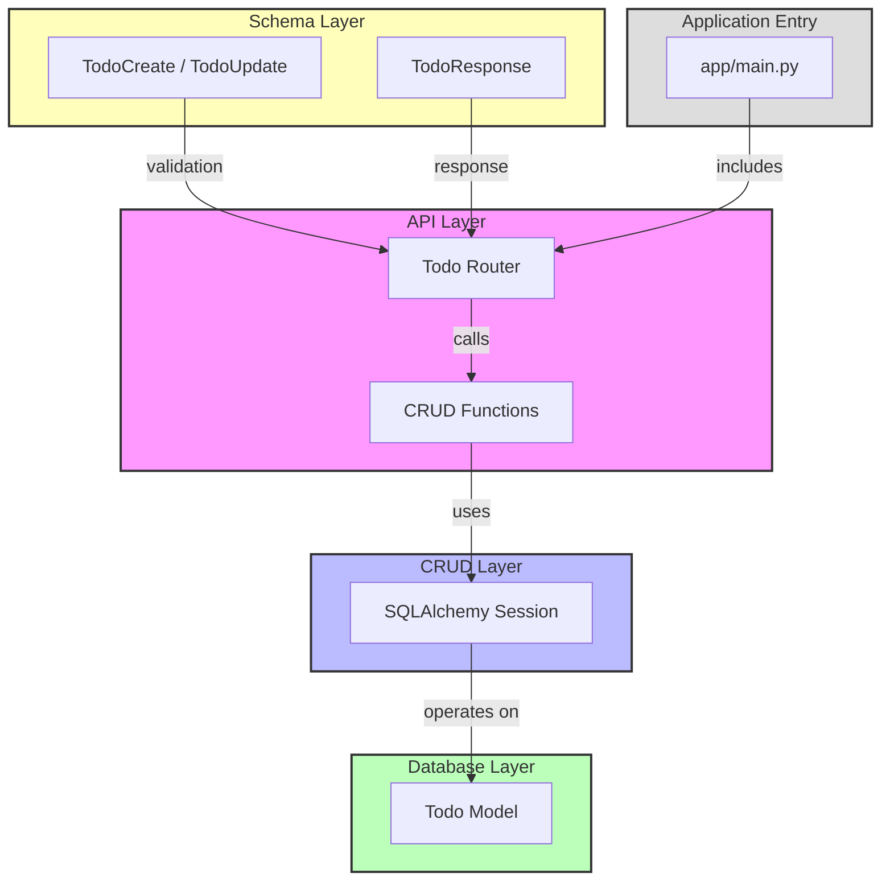

# Architecture Overview

The Todo API follows a **clean, modular architecture** that separates concerns into distinct layers:

1. **API Layer** – FastAPI routers that expose HTTP endpoints (`app/api`).
2. **Service/CRUD Layer** – Functions that implement business logic and interact with the database (`app/crud`).
3. **Database Layer** – SQLAlchemy models and session management (`app/models`, `app/db`).
4. **Schema Layer** – Pydantic models for request validation and response serialization (`app/schemas`).
5. **Application Entry Point** – FastAPI app creation and router inclusion (`app/main.py`).



## Technology Choices
- **FastAPI** – High‑performance web framework with automatic OpenAPI docs.
- **SQLite** – Lightweight, file‑based relational DB; perfect for a simple todo app.
- **SQLAlchemy** – ORM for defining models and handling DB sessions.
- **Pydantic** – Data validation and serialization for request/response bodies.
- **Uvicorn** – ASGI server for running the FastAPI app.

## Directory Layout
```
app/
├── __init__.py          # Makes `app` a package
├── main.py              # FastAPI app creation, router inclusion
├── api/                 # FastAPI routers (HTTP endpoints)
│   └── todo.py
├── crud/                # Business logic / CRUD helpers
│   └── todo.py
├── db/                  # Database engine & session handling
│   └── base.py
├── models/              # SQLAlchemy ORM models
│   └── todo.py
└── schemas/             # Pydantic schemas for validation/serialization
    └── todo.py

docs/
    └── architecture.md  # This document

tests/                    # Test suite (to be added later)
requirements.txt          # Python dependencies
```

The next steps will be to implement each module, write tests, and set up CI/CD.
