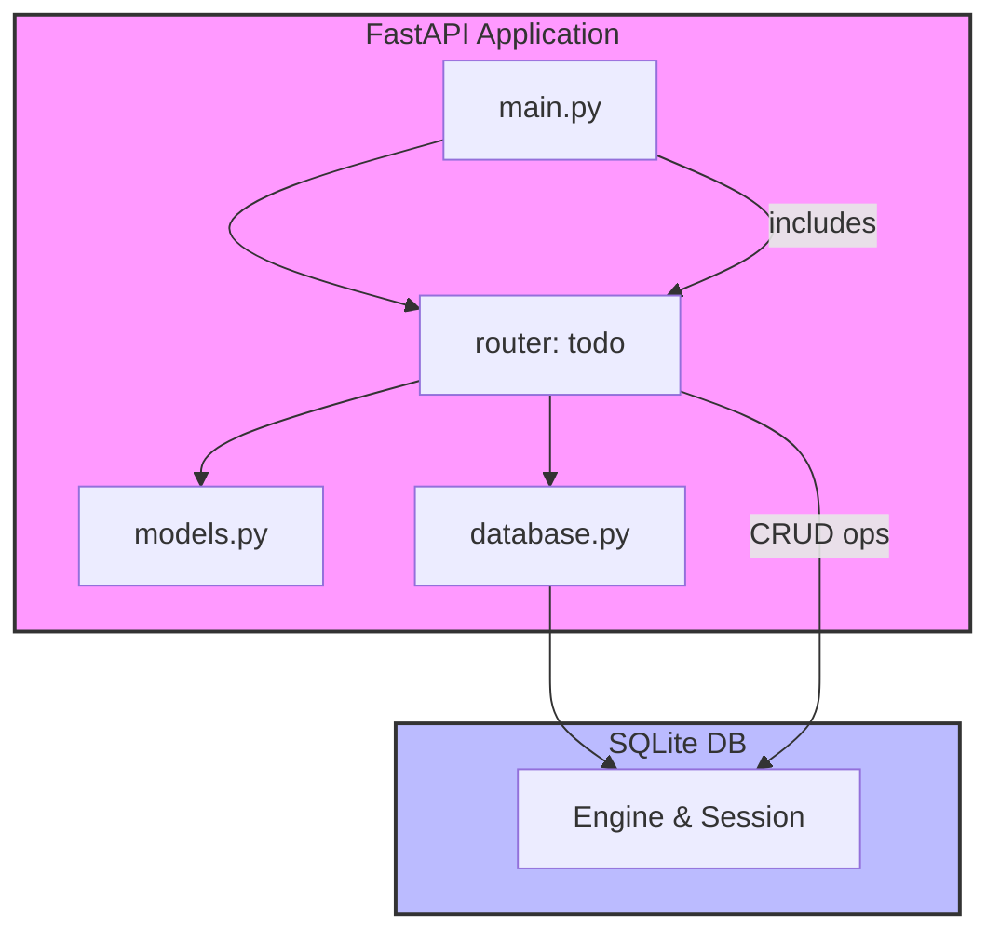

# Architecture Overview

This project implements a **Todo REST API** using **FastAPI** and **SQLite**. The design follows a clean, modular structure that separates concerns into distinct packages:

```
project_root/
├─ app/                     # Core application package
│  ├─ __init__.py           # Makes `app` a Python package
│  ├─ main.py               # FastAPI application entry point
│  ├─ models.py             # Data models (SQLModel / Pydantic)
│  ├─ database.py           # Database engine and session handling
│  └─ routers/              # API route definitions
│     ├─ __init__.py
│     └─ todo.py            # CRUD endpoints for Todo items
├─ tests/                   # Automated test suite
│  └─ test_todo.py          # Tests covering the Todo API
├─ .github/                 # CI/CD configuration
│  └─ workflows/
│     └─ ci.yml            # GitHub Actions workflow
├─ requirements.txt         # Python dependencies
├─ README.md                # Project documentation
└─ docs/
   └─ architecture.md      # This architecture document
```

## Technology Choices

| Concern               | Technology / Library | Rationale |
|-----------------------|----------------------|-----------|
| **Web framework**     | **FastAPI**          | High performance, async support, automatic OpenAPI docs, and excellent developer ergonomics. |
| **ORM / Data modeling** | **SQLModel** (built on SQLAlchemy & Pydantic) | Provides a concise way to define SQLite tables and Pydantic schemas in a single class, simplifying CRUD operations. |
| **Database**          | **SQLite** (via SQLModel) | Zero‑configuration, file‑based relational DB – perfect for a small Todo app and easy to run in CI. |
| **Testing**           | **pytest** + **httpx** | `httpx` offers an async client compatible with FastAPI's `TestClient`. |
| **CI/CD**             | **GitHub Actions**   | Native to GitHub, runs tests on every push/PR, and can enforce coverage thresholds. |

## High‑Level Flow

1. **Application startup** – `app/main.py` creates a `FastAPI` instance and includes the `todo` router.
2. **Database initialization** – `app/database.py` creates an SQLite engine and a session factory. On startup, tables are created automatically.
3. **Request handling** – Each endpoint in `app/routers/todo.py` receives a request, interacts with the database via a session, and returns a Pydantic‑validated response.
4. **Testing** – The test suite spins up the FastAPI app using `TestClient`, performs CRUD operations against the in‑memory SQLite DB, and asserts correct behavior and status codes.
5. **CI** – GitHub Actions installs dependencies, runs the test suite, and fails the workflow if coverage falls below 90%.

---

### Mermaid Diagram



---

## Next Steps

The **backend_developer** will now implement the concrete logic for each placeholder module, followed by the **qa_tester** to write comprehensive tests and ensure >90% coverage. The **devops_engineer** will later add the CI workflow.
