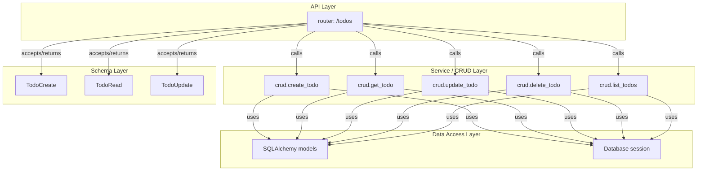

# System Architecture

This document outlines the high‑level architecture of the **FastAPI Todo API** project.

## Overview

The application follows a classic **layered architecture**:

1. **API Layer** – FastAPI routers expose HTTP endpoints.
2. **Service/CRUD Layer** – Functions that implement business logic and interact with the database.
3. **Data Access Layer** – SQLAlchemy models and a session manager handle persistence to an SQLite database.
4. **Schema Layer** – Pydantic models (schemas) define request/response payloads and validation.

All layers are loosely coupled via clear Python interfaces, making the codebase easy to test and extend.

## Component Diagram



## Technology Choices

| Layer | Technology | Reason |
|-------|------------|--------|
| **Web Framework** | **FastAPI** | High performance, automatic OpenAPI docs, async support. |
| **ORM** | **SQLAlchemy 2.0** | Mature, supports SQLite, declarative models. |
| **Data Validation** | **Pydantic (v2)** | FastAPI's native schema system. |
| **Database** | **SQLite** (file‑based) | Simple, zero‑config for development and CI. |
| **Containerisation** | **Docker** | Guarantees reproducible environment. |
| **CI** | **GitHub Actions** | Runs tests and coverage on each push/PR. |
| **Testing** | **pytest**, **coverage** | Widely used, easy to integrate. |

## Directory Layout

```
.
├─ app/                     # FastAPI application package
│  ├─ __init__.py
│  ├─ main.py               # Application entry point
│  ├─ models.py             # SQLAlchemy models
│  ├─ schemas.py            # Pydantic schemas
│  ├─ crud.py               # CRUD helper functions
│  ├─ database.py           # Engine & session handling
│  └─ routers/
│     ├─ __init__.py
│     └─ todo.py            # Todo router (endpoints)
├─ tests/                   # Test suite (to be implemented)
│  └─ test_todo.py
├─ Dockerfile               # Docker image definition
├─ docker-compose.yml       # Compose file for local dev
├─ requirements.txt         # Python dependencies
├─ docs/architecture.md    # This document
└─ README.md                # Project overview
```

---

*All modules contain `TODO` comments where implementation is required.  The backend developer will fill in the business logic, the frontend developer will add a UI placeholder, and the QA tester will write comprehensive tests.*