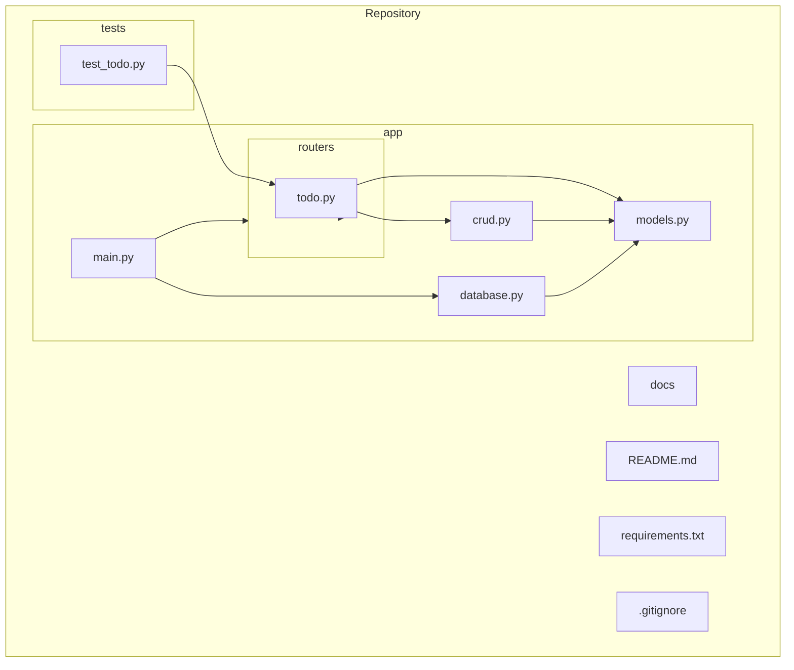

# Architecture Overview

This document describes the high‑level architecture of the **Todo API** built with **FastAPI** and **SQLite** using **SQLModel**.

## Technology Stack
- **FastAPI** – modern, fast (high‑performance) web framework for building APIs with Python 3.8+.
- **SQLModel** – combines SQLAlchemy core and Pydantic models, providing an easy ORM for SQLite.
- **SQLite** – lightweight, file‑based relational database; perfect for a small todo service.
- **Uvicorn** – ASGI server used to run the FastAPI application.
- **Python‑Dotenv** – optional, for loading environment variables (e.g., database path).

## Directory Layout

## Module Responsibilities
- **app/main.py** – creates the FastAPI instance, includes router(s), and starts the application.
- **app/models.py** – defines the `Todo` data model using `SQLModel` (includes table schema and Pydantic schema).
- **app/database.py** – configures the SQLite engine, session maker, and provides a dependency for request‑scoped DB sessions.
- **app/crud.py** – implements CRUD operations (create, read, update, delete) interacting with the database via the session.
- **app/routers/todo.py** – defines the REST endpoints (`/todos`) and uses the CRUD functions.
- **tests/** – will contain pytest test cases exercising the API (to be added later).

## Data Flow
1. **Request** arrives at FastAPI (`app/main.py`).
2. Router (`app/routers/todo.py`) matches the path and calls the appropriate CRUD function.
3. CRUD function (`app/crud.py`) uses a DB session (provided by `app/database.py`) to query/modify the SQLite database.
4. Response is serialized by FastAPI (leveraging Pydantic models) and returned to the client.

## Extensibility
- Adding authentication can be done by introducing a `users` router and models.
- Switching to a production‑grade DB (PostgreSQL, MySQL) only requires updating the engine URL in `database.py`.
- Additional resources (e.g., tags, categories) can be added as new models and routers following the same pattern.
