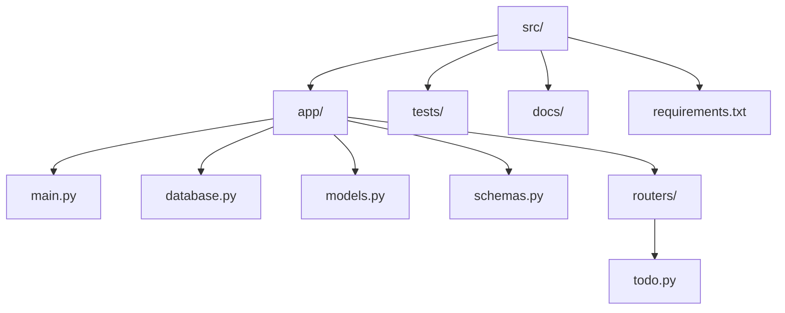
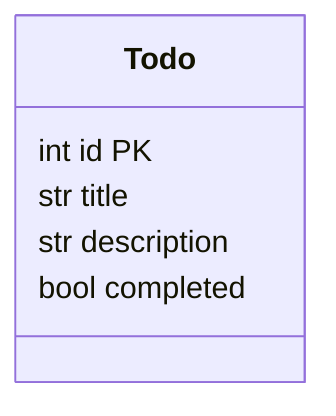

# Architecture Overview

## Project Overview
A simple **Todo** REST API built with **FastAPI** and **SQLite** using **SQLModel** for ORM. The service provides CRUD operations for todo items.

## Technology Stack
- **FastAPI** – Web framework for building APIs.
- **Uvicorn** – ASGI server.
- **SQLModel** – ORM built on top of SQLAlchemy and Pydantic, perfect for SQLite.
- **SQLite** – Lightweight file‑based relational database.
- **Pydantic** – Data validation and serialization (used via SQLModel).

## Directory Layout

## Module Responsibilities
- **app/main.py** – Application entry point, creates FastAPI instance and includes routers.
- **app/database.py** – Handles SQLite engine creation and session management.
- **app/models.py** – SQLModel definitions representing database tables.
- **app/schemas.py** – Pydantic models for request/response bodies (separate from DB models when needed).
- **app/routers/todo.py** – CRUD endpoint implementations.
- **tests/** – Pytest suite covering each endpoint.

## Data Model

## API Endpoints
| Method | Path | Description |
|--------|------|-------------|
| GET    | `/todos` | List all todos |
| GET    | `/todos/{todo_id}` | Retrieve a single todo |
| POST   | `/todos` | Create a new todo |
| PUT    | `/todos/{todo_id}` | Update an existing todo |
| DELETE | `/todos/{todo_id}` | Delete a todo |

## Development Workflow
1. Install dependencies: `pip install -r requirements.txt`
2. Run the server: `uvicorn app.main:app --reload`
3. Access interactive docs at `http://127.0.0.1:8000/docs`.

## Future Enhancements
- Authentication (OAuth2/JWT)
- Pagination & filtering
- Docker containerization
- CI/CD pipeline with GitHub Actions
