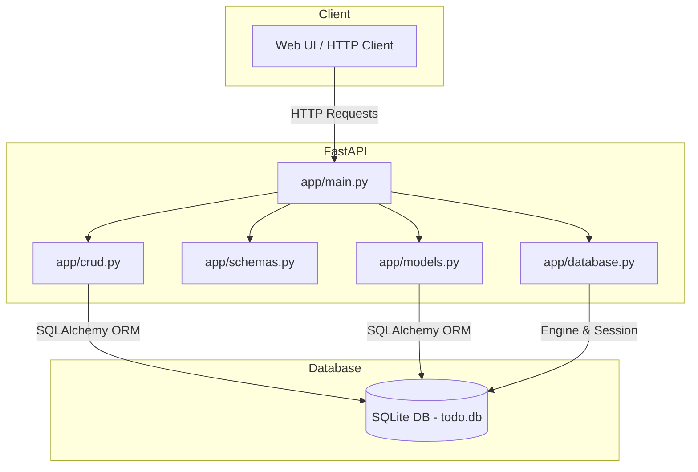

# Architecture Overview

This document provides a high‑level view of the Todo API built with **FastAPI**, **SQLAlchemy**, and **SQLite**.

## Component Diagram

## Data Flow
1. **Client** sends an HTTP request (e.g., `POST /todos`).
2. **FastAPI** receives the request in `app/main.py` and validates the payload using **Pydantic** schemas from `app/schemas.py`.
3. The route handler calls the appropriate **CRUD** function in `app/crud.py`.
4. **CRUD** interacts with the **SQLAlchemy** model defined in `app/models.py` via a **Session** provided by `app/database.py`.
5. SQLAlchemy translates the operation into SQL statements executed against the **SQLite** database file (`todo.db`).
6. Results are returned up the stack, converted back to Pydantic models, and sent as JSON responses to the client.

## Technology Choices
- **FastAPI** – modern, async‑first web framework with automatic OpenAPI docs.
- **SQLAlchemy** – powerful ORM that works well with SQLite and can be swapped for other DBs later.
- **SQLite** – file‑based relational DB, perfect for a lightweight todo app.
- **Pydantic** – data validation and serialization, integrated with FastAPI.
- **Uvicorn** – ASGI server for running the FastAPI app.

---
*Architecture diagram generated by the System Architect.*